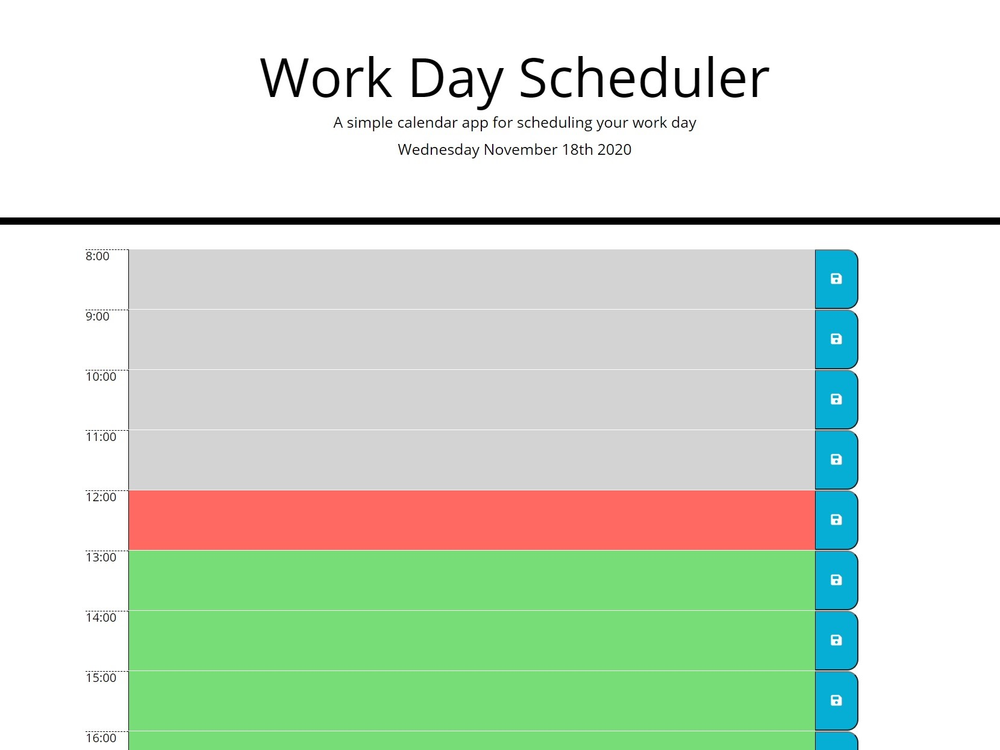
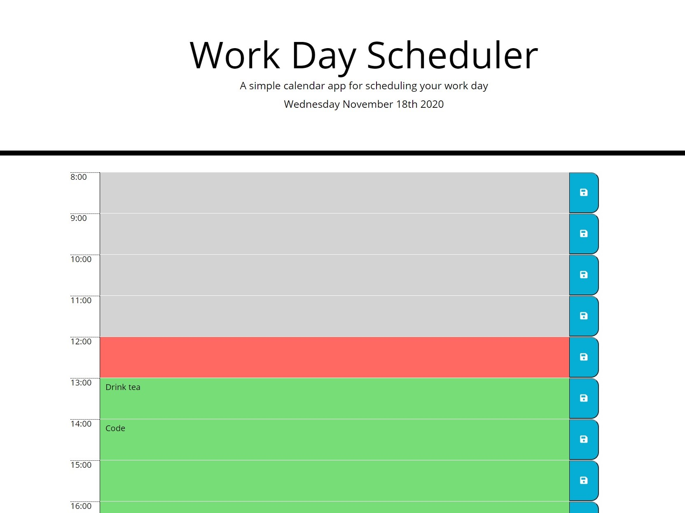

# JavaScript Day Planner

This repository contains a day planner created with HTML/CSS which dynamically updates with JavaScript and jQuery.

The page automatically gets the day/time and the user can add reminders for tasks to be completed throughout the day, which are saved to local storage.

## Live page

The coding quiz page is available [here](https://ross-mc.github.io/day-planner-app/)

## Screenshots

